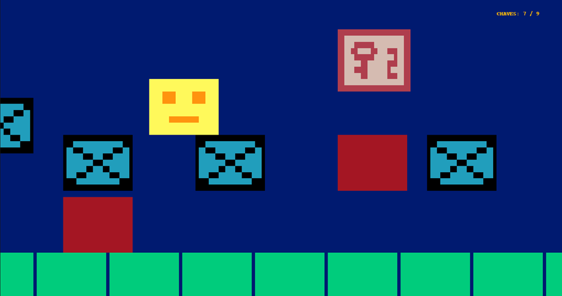
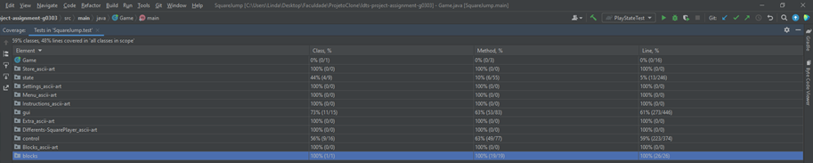

 LDTS_T03_G03 - SQUARE JUMP

## Descrição do Jogo

Square Jump é um jogo de arcade, baseado no jogo já existente Geometry Dash, cujo objetivo é conseguir ultrapassar obstáculos para não morrer e apanhar chaves que vão estar ao seu dispor de maneira que o jogador consiga completar o jogo.
Será dada ao jogador a opção de escolha entre 3 níveis de dificuldade e conforme a escolha, o número de obstáculos, tal como a dificuldade de apanhar as chaves vai ser maior ou menor.
## Funcionalidades Implementadas

- **Menus conectados** - O utilizador, através do menu principal, consegue aceder a outros, como _Store_, _Instructions_, _Play_ e _Settings_.
- **Store** - Uma loja em que o jogador pode mudar a cor do Jogo e do _design_ do Square com as moedas que ganha ao passar os níveis.
- **Instructions** - Uma opção do menu inicial que contém todas as instruções necessárias à utilização da aplicação.
- **Play** - Opção do menu que inicializa o jogo no nivel previamente definido ou o por defeito.
- **Settings** - Opção do menu inicial que permite definir os níveis e consultar uma breve explicação do que se pode ganhar em cada nivel assim como os objetivos.
- **Movimento** - Para o utilizador poder movimentar-se de uma opção para outra, vão ser utilizadas as _arrow keys_ e o _enter_ para selecionar.
- **Selecionar** - Para o Utilizador entrar em uma das opções escolhida é necessário que utilize o _enter_.
- **Comprar** - Possibilidade de comprar diferentes cores e _design_ na _store_.
- **Dinheiro** - Sistema de moedas fictício, é utilizado na store e pode ser ganho ao passar níveis.
- **Níveis** - Existem 3 níveis de dificuldade, do 1 ao 3, de dificuldade crescente.
- **Deslocamento** - O Square pode se deslocar com as setas esquerda e direita para a esquerda e direita, respetivamente.
- **Empurrar** - o Square quando bate contra um bloco não letal é empurrado.
- **Scroll** - o Jogo vai fazer _scroll_ a uma velocidade constante até chegar ao final.
- **Saltar** - o square tem a opção de saltar para evitar obstáculos.
- **Obstáculos** - Vai haver três categorias de obstáculos: os que ajudam o jogador, e se pode tocar, os que matam o jogador, e não se pode tocar, e os que indicam que chegou ao fim do nivel.
- **Chaves** - Durante o jogo, o jogador vai ter que apanhar diversas chaves para passar de nível. O número de chaves necessárias varia conforme o nível que foi escolhido.
- **Powerups** - O jogador pode ter acesso a dois powerups, uma caixa que vale por duas chaves e outra caixa que permite ganhar o jogo sem ser preciso ir até ao fim do nível.
- **Ganhar** - Se o jogador chegar até aos obstáculos finais e tiver todas as chaves necessárias ganha o jogo e recebe moedas de acordo com o nivel.
- **Perder** - Se o jogador chegar até ao obstáculo final e não tiver todas as chaves necessárias, não ganha o jogo nem recebe moedas.
- **Falhar** - Se o jogador bater contra um dos obstáculos que mata o Square perde o nivel e tem de começar tudo de novo.
- **Powerups** - O jogador pode ter acesso a dois _powerups_, uma caixa que vale por duas chaves e outra caixa que permite ganhar o jogo sem ser preciso ir até ao fim do nível.
- **Sair** - Para o utilizador poder sair da aplicação a qualquer momento, pode usar a tecla '_q_'.
- **Retroceder** - Quando o utilizador pode usar a tecla '_esc_' para retroceder para o menu.

## Possíveis Funcionalidades
Funcionalidades que o grupo tinha como objetivo implementar, mas que não teve tempo/não conseguiu realizar.
- **Nível Personalizado** - Modo em que o jogador consegue montar o seu próprio nível.
- **Powerups** - Uma maior quantidade de powerups como a capacidade de saltar mais alto, atravessar os obstáculos sem morrer e colocar o tempo de jogo mais lento.
- **Pausa** - Para o jogador poder parar o jogo a meio pode utilizar a tecla 'p'.

## Game Shots

- Menu Inicial

- Opção do Menu Inicial:  Settings

- Opção do Menu Inicial:  Instructions

- Opção do Menu Inicial:  Store

- Pequena amostra do nível 1

- O que acontece se o jogador acabar o nível sem chaves suficientes

- O que acontece se o jogador passar o nível com sucesso, neste caso o terceiro

- Quando o Square toca nos obstáculos que o fazem morrer

- Amostra de um dos powerups

- No final do jogo o Square deve ir contra os 3 blocos no canto direito para terminar o jogo
  

## Design Patterns

### _State Pattern_

#### Problemas em contexto
Utilizamos o **_State Pattern_** para conseguir alternar entre diferentes estados como o _MenuOptionState_ e o _PlayState_.  
Em alternativa poderíamos ter feito tudo numa única classe, mas isso implicaria a utilização em demasia de expressões condicionais tornando a classe em questão numa _Large Class_ (_code smell_), e também não iria conforme o _Single Responsibility Principle_.
          
                
#### O Pattern no projeto
O _State Pattern_ vem de um _Behavior State Pattern_, que permite a um objeto alterar o seu comportamento quando o seu estado interno muda.  
No contexto do nosso trabalho, permitiu alternar entre os diferentes estados que planeamos que o nosso jogo tivesse de maneira eficaz, permitindo ter um código mais limpo e de fácil compreensão para os elementos do grupo e para uma pessoa de fora que não conheça o código na sua forma total perceber o que acontece nas classes que usam este padrão.  
Por exemplo, no _MenuOptionState_, o código utilizado para alterar o menu é fácil de identificar e perceber.

#### Implementação

**As classes que utilizam este padrão podem ser encontradas nos seguintes ficheiros:**
> [Option State](../src/main/java/state/OptionState.java)
> 
> [MenuOption State](../src/main/java/state/MenuOptionState.java)
> 
> [Play State](../src/main/java/state/PlayState.java)
> 
> [Settings State](../src/main/java/state/SettingsState.java)
> 
> [Store State](../src/main/java/state/StoreState.java)
> 
> [Winning State](../src/main/java/state/WinningState.java)
> 
> [Losing State](../src/main/java/state/LosingState.java)
> 
> [GameOver State](../src/main/java/state/GameOverState.java)
> 
> [Instructions State](../src/main/java/state/InstructionsState.java)
> 
> [Controller](../src/main/java/control/Controller.java)

  

#### Consequências

- Eficácia do código;
- Fácil correção dentro de cada estado;
- Fácil adicionar um novo estado se necessário;
- Está explícito o que acontece em cada um dos estados.

### Movimento do Square

#### Problemas em contexto
Pensando na implementação do movimento e a possibilidade futura de adicionar mais e diferentes tipos de movimentos foi utilizado o **_Factory Pattern_**.  
Se fizéssemos esta parte do projeto sem este padrão o que ia acontecer era termos uma classe muito grande (_code smell: large class_) e ela ia ter mais de um motivo para ser alterada (Violação do _Single Principle Responsibility_). 
Além disso, se quisermos adicionar mais e diferentes tipos de movimentos, sem o _Factory Pattern_, iria contra o princípio _Open/Closed_.

#### O Pattern no projeto
Com este simples padrão apoiamo-nos na criação de um código mais limpo, que ajuda na prevenção de erros causados pela falta de clareza da execução de uma classe e permite um fácil desenvolvimento e aumento dos tipos de movimentos.  
No nosso caso, após feitas as classes _Right_ e _Left_ que estendem o movimento, mais especificamente o movimento de andar para a direita e para a esquerda, respetivamente, foi fácil adicionar o movimento de queda e salto (_Gravity_ e _Jump_).

#### Implementação

**As classes que utilizam este padrão podem ser encontradas nos seguintes ficheiros:**
> [Abstract Movement](../src/main/java/control/movement/Movement.java)
>
> [Gravity](../src/main/java/control/movement/Gravity.java)
>
> [Jump](../src/main/java/control/movement/Jump.java)
>
> [Left](../src/main/java/control/movement/Left.java)
>
> [Right](../src/main/java/control/movement/Right.java)
>
> [Push](../src/main/java/control/movement/Push.java)

#### Consequências

- Código mais fácil de entender depois do uso deste padrão;
- Os erros na implementação de um movimento específico ficam mais fáceis de localizar e consequentemente corrigir;
- Aumentos no código são facilmente conseguidos mesmo que não se entenda a implementação das outras classes (movimentos);
- Os princípios SOLID são obedecidos.

### Strategy Pattern

#### Problemas em contexto
Para a organização dos níveis foi utilizado o **_Strategy Pattern_**.  
Se não utilizássemos este padrão acabaríamos por ter uma _Long Class_ para além de falta de organização do código que não permitiria a boa compreensão do que acontece em cada nível.
     
  
#### O Pattern no projeto
O _Strategy Pattern_ permite extrair pedaços de código de uma classe e colocá-los em classes separadas de tal forma que o objetivo continua a ser o mesmo.  
Antes de ser feito o refactoring, tínhamos uma _long class_ Level que continha os 3 níveis por isso sempre que queríamos adicionar algo a um destes, por consequência a classe ficava cada vez maior e mais desorganizada, para além de confusa.  
Com o _Strategy Pattern_ foi possível alcançar uma melhor organização e compreensão do que está a ser feito em cada nível e completar o objetivo pretendido com mais eficácia.

#### Implementação

**As classes que utilizam este padrão podem ser encontradas nos seguintes ficheiros:**
> [Interface ArrayLevel](../src/main/java/control/level/ArrayLevel.java)
>
> [Level](../src/main/java/control/level/Level.java)
>
> [Level 1](../src/main/java/control/level/Level1.java)
>
> [Level 2](../src/main/java/control/level/Level2.java)
>
> [Level 3](../src/main/java/control/level/Level3.java)
>
> [Level Controller](../src/main/java/control/level/LevelController.java)

#### Consequências

- Código mais simples e fácil de perceber;
- Conforme o princípio _Open/Close_;
- Fácil correção dos erros encontrados;
- Fácil adição de mais elementos nos níveis se necessário.

### Lanterna 

#### Problemas em contexto
No nosso projeto desenvolvemos o jogo com ajuda da biblioteca **Lanterna**.  
Por isso, vimos a necessidade de fazer uma classe que lide diretamente com a biblioteca e todas as operações necessárias antes da chamada, o resto das outras classes no jogo apenas necessitavam de chamá-la. 
O problema que nos deparamos era que ao longo do tempo e à medida que o código do jogo aumentava também aumentava a classe que lidava com a lanterna. Chegou a tal ponto que começava a ser difícil encontrar as classes no meio das outras todas por isso muito tempo era gasto a fazer _scroll_.  
Isto significava que tínhamos um code smell: _long class_, e precisávamos de fazer refactoring. Depois de alguma investigação pedagógica da melhor maneira para o fazer, chegamos à conclusão que o método extract class era o mais indicado para o nosso objetivo concreto.  
Então a classe lanterna foi dividida em várias classes de acordo com aquilo que faziam. A classe lanterna passou então a servir como uma espécie de _interface_ que apenas manda a para a classe onde o método está hospedado.

#### O Pattern no projeto
Segundo a definição, o _design_ Facade é um padrão de _design_ estrutural que fornece uma _interface_ simplificada para uma biblioteca, uma estrutura ou outro conjunto complexo de classes.

#### Implementação

 
**nota:** Nos suprimimos algumas partes do diagrama e removemos classes interira porque não eram o foco da explicação deste padrão servindo apenas como repetição daquilo que o diagrama tenta contar, apesar disso essas classes, atributos e metodos continuam a ser importantes.

**As classes que utilizam este padrão podem ser encontradas nos seguintes ficheiros:**
> [Lanterna](../src/main/java/gui/LanternaGUI/Lanterna.java)
>
> [Instruction](../src/main/java/gui/LanternaGUI/InstructionLanterna.java)
>
> [Game Over](../src/main/java/gui/LanternaGUI/GameOverLanterna.java)
>
> [Losing](../src/main/java/gui/LanternaGUI/LosingLanterna.java)
>
> [Menu](../src/main/java/gui/LanternaGUI/MenuLanterna.java)
>
> [Play](../src/main/java/gui/LanternaGUI/PlayLanterna.java)
>
> [Settings](../src/main/java/gui/LanternaGUI/SettingsLanterna.java)
> 
> [Store](../src/main/java/gui/LanternaGUI/StoreLanterna.java)
> 
> [Winning](../src/main/java/gui/LanternaGUI/WinningLanterna.java)

#### Consequências

- Melhorar a legibilidade do código;
- Melhorar a procura por métodos específicos;
- Mais fácil o desenvolvimento de novos métodos;
- Permite uma interface direta (mas limitada) de um sistema complexo e longo.

### _Game Loop_ Pattern

#### Problemas em contexto
Para o jogo correr sem ser interrompido e estar sempre a fazer update foi utilizado o Game Loop Pattern.  
Este pattern permite-nos fazer interações com o jogo e observá-las no terminal.

#### O Pattern no projeto
Segundo a definição, o Game Loop Pattern está presente em todos os jogos modernos como forma de impulsionar o processo de entrada no jogo e atualizar o seu estado interno, fazendo com que o tempo do jogo avance com igual velocidade em todas as configurações.

#### Implementação
        

#### Consequências
- Update constante do jogo;
- Fornecimento da imagem a cada interação;
- Permite ao jogo continuar a correr mesmo que não haja nenhum “_input_" do jogador.
- O programa continua a correr até o jogador decidir o contrário.

## Code Smells and Refactorings
Quando foi feito um refactoring do trabalho, reparamos existirem muitos _code smells_, que fomos capazes de corrigir apesar de ainda haver muito para melhorar, tais como:
- Uma **_large class_** ([LanternaGUI Package](../src/main/java/gui/LanternaGUI)) que aplicando o _Extract Method_ conseguimos obter o mesmo objetivo com um código mais limpo e organizado;
- Simplificação de **expressões condicionais**, em algumas classes tal como [Store State](../src/main/java/state/StoreState.java) chegamos a ter um case-switch muito grande e confuso para analisar, então a nossa solução foi dividir em dois métodos diferentes (_Colorbuy_ e _Squarebuy_) e desta forma conseguimos ter uma melhor organização e compreensão do objetivo a atingir.
- Anteriormente, a classe _Level_ era a única classe que trabalhava diretamente com os níveis (_large class_), de maneira que cada vez que queríamos acrescentar um novo elemento a um dos níveis ou elementos novos para o jogo no geral, ficava muito confuso perceber onde colocar e a classe ia ficando cada vez maior. Desta forma como já foi referido anteriormente decidimos usar um _Strategy Pattern_ para podermos extrair cada nível para uma classe diferente e assim estar mais organizado, além de mais eficiente.

### _Dispensables_

#### Comentários
- Ao longo do código é possível encontrar alguns comentários que servem como uma explicação quer aos elementos do grupo, quer a pessoas que não conhecem bem o código, o que significa o valor de cada flag, por exemplo, como é no caso da classe [Gravity](../src/main/java/control/movement/Gravity.java).

#### _Data class_
- [Option](../src/main/java/control/Option.java): Esta classe contém apenas métodos de _set_ e _get_ para as opções escolhidas pelo utilizador.
- [Element](../src/main/java/blocks/Element.java): Classe que além do construtor só tem _gets_ e _setters_ que guardam posições dos elementos do jogo.
- [Position](../src/main/java/control/Position.java): Classe que apenas serve para guardar junto as posições do x e y.

### _Couplers_
#### Message Chains
- Ao longo do codigo é possivel encontrar uma cadeia reversa de mensagens que através do int especifico comunica que categoria de ação é necessaria fazer nas classes que o chamaram (exemplo: classe [PlayState](../src/main/java/state/PlayState.java))

## Testes

.png)

.png)

.png)

## Autoavaliação
       
| Nome            | Contribuição |
| --------------- |--------------|
| Mónica Araújo   | 50 %         | 
| Linda Rodrigues | 50 %         |

## Observações
Devido à inexperiência das autoras deste projeto foi impossivel seguir totalmente a tecnica de desenvolvimento de ‘software’ guiada por Testes (TDD).
Existiu varias tentativas de primeiro desenvolver os teste e depois é que fazer o codigo e no final fazer o refactory. No entanto, como foi a nossa primeira vez que desenvolvemos um projeto deste tipo e tamanho não sabiamos muito bem o que queriamos fazer e como o iriamos fazer.
Dessa forma aconteceu de primeiro escrevemos o codigo e só depois e que testavamos e faziamos refactory.

